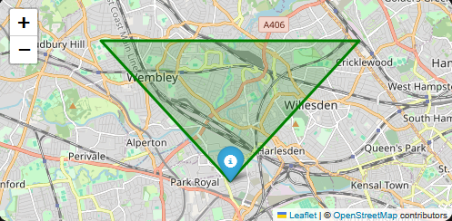

# What's that plane?!

This repository is an extended fork of [8bither0/whats-that-plane](https://github.com/8bither0/whats-that-plane), the original Home Assistant integration for tracking aircraft passing through a configurable field of view from a fixed location.

Full credit goes to [@8bither0](https://github.com/8bither0) for the original project, idea, and integration foundation. This fork builds on that work and focuses on exposing richer flight data, improved dashboard usability, and more reusable Home Assistant presentation patterns.

## Why this fork exists

The upstream project already solved the core problem really well: tracking aircraft inside a directional field of view rather than only within a simple radius around a point.

This fork keeps that core approach, but extends the data exposed to Home Assistant and adds more reusable dashboard patterns around it. The aim is not to replace the original project, but to build on it for users who want more detailed aircraft metadata and more complete Lovelace examples.

## What this fork adds

Compared with the upstream project, this fork expands the integration with:

- richer flight metadata such as `flight_number`, `status_live`, `status_icon`, and `aircraft_icao`
- additional airline and aircraft details including airline codes and airline logo links
- heading helpers such as `heading_compass`
- improved origin and destination metadata including flag-ready country codes
- historic flight attributes such as `last_seen_timestamp` and `last_seen_time_formatted`
- reusable Home Assistant dashboard patterns using Decluttering Card
- more advanced Lovelace examples for live flights, recent flights, and map-based views

## Example screenshots

### Mobile flight list view

A compact mobile dashboard example showing a currently tracked flight with route, progress, departure and arrival timing, altitude, speed, aircraft details, and quick outbound links.


### Last x Flights Overheard

A long-form mobile view showing the past x flights overhead in a list, demonstrating how the reusable dashboard layout works well for browsing several flights and recent history on smaller screens.


### My Dashboard

Here is how I use the flight cards in my Dashboard.


## Installation

### HACS via link (Recommended)
[](https://my.home-assistant.io/redirect/hacs_repository/?owner=LeonArmston&repository=whats-that-plane-leon&category=integration)

1. Click the button above to open the integration in Home Assistant Community Store in Home Assistant.
2. Click `Add`.
3. Click the `Download` button in the bottom right corner.
4. Restart Home Assistant.
5. Now go to your Home Assistant settings and click on `Devices & services`.
6. Click the `Add Integration` button in the bottom right corner and search for `What's that plane?!`.
7. Select `What's that plane?!` and move onto the [Configuration](#configuration) section.

### HACS via custom repositories

1. Go to the Home Assistant Community Store in Home Assistant.
2. Click on the kebab icon in the top right corner and choose `Custom repositories`.
3. In the `Repository` field, enter `https://github.com/LeonArmston/whats-that-plane-leon` and select `Integration` as the `Type`.
4. Click `Add` then close `Custom repositories`.
5. If you now search HACS for `What's that plane?!` you should see the integration in the repository list. Click on the `What's that plane?!` integration.
6. Click the `Download` button in the bottom right corner.
7. Restart Home Assistant.
8. Now go to your Home Assistant settings and click on `Devices & services`.
9. Click the `Add Integration` button in the bottom right corner and search for `What's that plane?!`.
10. Select `What's that plane?!` and move onto the [Configuration](#configuration) section.

### Manual

1. Clone this repository to your local machine.
2. Copy the `custom_components/whats_that_plane` directory to the `custom_components` directory in your Home Assistant file system.
3. Restart Home Assistant.
4. Now go to your Home Assistant settings and click on `Devices & services`.
5. Click the `Add Integration` button in the bottom right corner and search for `What's that plane?!`.
6. Select `What's that plane?!` and move onto the [Configuration](#configuration) section.

## Configuration

To initially configure the integration, define the information below. This can be reconfigured via configuration entry options after initial setup:

| Option                              | Required | Example value                     | Description |
| :-------------------                | :------: | :-----------:                     | :---------- |
| `location_name`                     | ❌       | `Home`                            | A friendly name for your defined coordinates. This will be appended to the integration entry in the format `Visible flights (<location_name>)`. |
| `latitude`                          | ✅       | `51.5285262`                      | The latitude of your viewing location. This will default to the coordinates defined in your [homeassistant.local](https://www.home-assistant.io/docs/configuration/basic/) configuration if available. |
| `longitude`                         | ✅       | `-0.2663999`                      | The longitude of your viewing location. This will default to the coordinates defined in your [homeassistant.local](https://www.home-assistant.io/docs/configuration/basic/) configuration if available. |
| `radius_km`                         | ✅       | `5`                               | The radius distance boundary from your current location. e.g. `5` = 5km |
| `facing_direction`                  | ✅       | `0`                               | The degree bearing of the viewing direction. e.g. `0` = North, `90` = East, `180` = South, `270` = West. |
| `fov_cone`                          | ✅       | `90`                              | The number of degrees the field of view cone should be. |
| `update_interval`                   | ✅       | `10`                              | The number of seconds between each poll for flight information. |
| `filter_flight_altitude_ft_minimum` | ❌       | `0`                               | The minimum flight altitude in feet for flights to be recorded. |
| `filter_flight_altitude_ft_maximum` | ❌       | `60000`                           | The maximum flight altitude in feet for flights to be recorded. |
| `hold_flight_data_seconds`          | ❌       | `0`                               | The total number of seconds to keep a flight's data after it leaves your field of view. This can act as a grace period to prevent flights disappearing immediately. |
| `historic_flights_max_count`        | ❌       | `0`                               | The total number of past flights to store in history. Can be used to show x number of flights that have recently passed by. |
| `distance_units`                    | ❌       | `metric (kilometres (km))`        | The unit of measurement to record flight distance in. |
| `altitude_units`                    | ❌       | `imperial (feet (ft))`            | The unit of measurement to record flight altitude in. |
| `speed_units`                       | ❌       | `imperial (miles per hour (mph))` | The unit of measurement to record flight speed in. |

> 💡 **TIP**: To make the initial configuration process easier, you can use the map card to easily visualise your FOV cone settings while you adjust the initial settings. See [Visualising recorded flights on a map card](#visualising-recorded-flights-on-a-map-card).

After configuring the integration, a new sensor named `sensor.visible_flights` will be created. This updates at the frequency defined by `update_interval` and exposes both live and historic flight information through attributes.

## Sensor data model

The sensor exposes three top-level attributes:

- `config`: your active integration configuration used to calculate visibility and unit conversions
- `flights`: a list of currently visible flights
- `historic_flights`: a list of recently visible flights when `historic_flights_max_count` is enabled

### `config` attributes

| Attribute | Description |
| :-- | :-- |
| `latitude` | Viewing location latitude. |
| `longitude` | Viewing location longitude. |
| `radius_km` | Search radius from the viewing location. |
| `facing_direction` | Bearing used as the centre of the field-of-view cone. |
| `fov_cone` | Width of the field-of-view cone in degrees. |
| `distance_units` | Selected distance unit label used by the integration. |
| `altitude_units` | Selected altitude unit label used by the integration. |
| `speed_units` | Selected speed unit label used by the integration. |

### Flight object attributes

Every entry in `flights` and `historic_flights` can expose the following fields, depending on what FlightRadar24 returns for that aircraft.

#### Identity and status

| Attribute | Description |
| :-- | :-- |
| `callsign` | Flight callsign. |
| `flight_id` | FlightRadar24 flight identifier. |
| `flight_number` | Published flight number. |
| `flightradar_link` | Direct link to the flight on FlightRadar24. |
| `status_live` | Whether the flight is currently marked as live by FlightRadar24. |
| `status_icon` | Status icon value returned by FlightRadar24. |

#### Airline and aircraft

| Attribute | Description |
| :-- | :-- |
| `airline_name` | Airline name. |
| `airline_iata` | Airline IATA code. |
| `airline_icao` | Airline ICAO code. |
| `airline_logo_link` | Derived FlightRadar24 airline logo URL based on the ICAO code. |
| `aircraft_model` | Aircraft model name. |
| `aircraft_type` | Aircraft type code. |
| `aircraft_icao` | Aircraft ICAO hex code. |
| `aircraft_registration` | Aircraft registration. |
| `large_aircraft_image_link` | Large aircraft image URL. |
| `medium_aircraft_image_link` | Medium aircraft image URL. |
| `small_aircraft_image_link` | Small aircraft image URL. |
| `thumbnail_aircraft_image_link` | Thumbnail aircraft image URL. |

#### Position, motion, and route progress

| Attribute | Description |
| :-- | :-- |
| `latitude` | Current aircraft latitude. |
| `longitude` | Current aircraft longitude. |
| `altitude` | Current aircraft altitude in the selected units. |
| `ground_speed` | Current ground speed in the selected units. |
| `ground_speed_kts` | Current ground speed in knots. |
| `heading` | Current heading in degrees. |
| `heading_compass` | Cardinal or intercardinal heading derived from `heading`. |
| `total_distance` | Total route distance in the selected distance units. |
| `distance_traveled` | Distance already traveled in the selected distance units. |
| `progress_percent` | Percent of route completed. |
| `total_flight_time_formatted` | Calculated total flight time as a formatted string. |
| `trail` | Recorded flight trail points used by the map card. |

#### Origin and destination

| Attribute | Description |
| :-- | :-- |
| `origin_city` | Origin city. |
| `origin_country` | Origin country name. |
| `origin_country_code` | Origin country code from FlightRadar24. |
| `origin_country_code_flagsapi` | Origin country code normalised for flag/image usage. |
| `origin_country_code_long` | Origin country long code. |
| `origin_flag_emoji` | Emoji flag derived from the origin country code. |
| `origin_airport_name` | Origin airport name. |
| `origin_airport_code` | Origin airport IATA code. |
| `origin_latitude` | Origin airport latitude. |
| `origin_longitude` | Origin airport longitude. |
| `destination_city` | Destination city. |
| `destination_country` | Destination country name. |
| `destination_country_code` | Destination country code from FlightRadar24. |
| `destination_country_code_flagsapi` | Destination country code normalised for flag/image usage. |
| `destination_country_code_long` | Destination country long code. |
| `destination_flag_emoji` | Emoji flag derived from the destination country code. |
| `destination_airport_name` | Destination airport name. |
| `destination_airport_code` | Destination airport IATA code. |
| `destination_latitude` | Destination airport latitude. |
| `destination_longitude` | Destination airport longitude. |

#### Schedule and delay data

| Attribute | Description |
| :-- | :-- |
| `scheduled_departure_time_local` | Scheduled departure time converted to the origin timezone. |
| `estimated_departure_time_local` | Estimated departure time converted to the origin timezone. |
| `real_departure_time_local` | Actual departure time converted to the origin timezone. |
| `estimated_departure_delay_mins` | Estimated departure delay in minutes. |
| `departure_delay_mins` | Actual departure delay in minutes. |
| `scheduled_arrival_time_local` | Scheduled arrival time converted to the destination timezone. |
| `estimated_arrival_time_local` | Estimated arrival time converted to the destination timezone. |
| `real_arrival_time_local` | Actual arrival time converted to the destination timezone. |
| `estimated_arrival_delay_mins` | Estimated arrival delay in minutes. |
| `arrival_delay_mins` | Actual arrival delay in minutes. |

#### Historic flight fields

| Attribute | Description |
| :-- | :-- |
| `last_seen_timestamp` | Timestamp for when the aircraft was last seen in your FOV. |
| `last_seen_time_formatted` | Human-readable relative last-seen string such as `5m ago`. |

## Building dashboard cards with Decluttering Card

The recommended approach for this fork is to define a reusable Decluttering Card template and then instantiate it with variables for live flights and historic flights.

This gives you a single card definition that can be reused for:

- currently visible flights
- historic flights
- different sensor entities
- different card titles
- different empty-state messages

It also makes it easier to take advantage of the richer fields exposed by this fork, including:

- `flight_number`
- `status_icon`
- `heading_compass`
- `airline_logo_link`
- `aircraft_icao`
- `last_seen_time_formatted`
- `origin_country_code_flagsapi`
- `destination_country_code_flagsapi`
- `trail`

### Requirements

- [Decluttering Card](https://github.com/custom-cards/decluttering-card)
- [card-mod](https://github.com/thomasloven/lovelace-card-mod)

### Notes

- The blocked-flight check uses `Blocked` with a capital `B` because that is how the integration exposes blocked callsigns.
- Vertical trend calculation relies on timestamped trail data being present.
- Airline logos and some external links depend on third-party services and may not always resolve for every flight.

### 1) Define the reusable template

```
decluttering_templates:
  flight_list_card:
    default:
      - sensor_entity: sensor.visible_flights
      - flights_attribute: flights
      - card_title: "Flights"
      - empty_message: "No flights."
    card:
      type: markdown
      title: "[[card_title]]"
      content: >
        

        
        
        
        

        
        
        
        

        
        
        
          
        

        
        
        
        
        
          
          
          
          
          
            
          
          
            
            
          
            
            
          
        

        

        
          {{ status_dot }} 🚫 {{ icon }} [**{{ flight.callsign }}**]({{ flight.flightradar_link }})
          
          **{{ flight.aircraft_model }}** *({{ flight.aircraft_type }})* | **Registration:** [{{ flight.aircraft_registration }}](https://www.flightradar24.com/data/aircraft/{{ flight.aircraft_registration | lower }})Unknown | **ICAO:** `{{ flight.aircraft_icao }}`
          📈 **Altitude:** {{ flight.altitude | default(0, true) | round(0) }} {{ altitude_unit }} {{ vtrend_icon }} | **Speed:** {{ flight.ground_speed_kts | default(0, true) }} kts ({{ (flight.ground_speed | default(0, true)) | round(0) }} {{ speed_unit }})
          
          
          
          
          
          
          
          

        
          {{ status_dot }} {{ icon }} **{{ flight.airline_name }} [**{{ flight.flight_number }}**]({{ flight.flightradar_link }}) (**{{ flight.origin_airport_code }} → {{ flight.destination_airport_code }}**)**

          
            
            
            **{{ flight.origin_airport_code }}** `{{ '─' * (plane_pos - 1) }}✈{{ '─' * (bar_width - plane_pos) }}` **{{ flight.destination_airport_code }}** 
            📏 **Distance:** *{{ flight.distance_traveled }} of {{ flight.total_distance }} {{ distance_unit }} ({{ flight.progress_percent }}%)*
          
          📈 **Altitude:** {{ flight.altitude | default(0, true) | round(0) }} {{ altitude_unit }} {{ vtrend_icon }} *{{ vtrend_label }} {{ vtrend_rate | abs }} ft/min* | **Speed:** {{ flight.ground_speed_kts | default(0, true) }} kts ({{ (flight.ground_speed | default(0, true)) | round(0) }} {{ speed_unit }}) | **Heading:** {{ flight.heading_compass | default('Unknown') }}
          
          🕑 **Total Flight Time:** {{ flight.total_flight_time_formatted }}
          

          
          🌍 {{ flight.origin_city }}, _**{{ flight.origin_country }}**_ → {{ flight.destination_city }}, _**{{ flight.destination_country }}**_
          🛂 <a href="https://google.co.uk/maps?q={{ flight.origin_latitude }},{{ flight.origin_longitude }}" title="{{ flight.origin_airport_name }}">{{ flight.origin_airport_name | replace('Airport', 'Apt') }}</a> → <a href="https://google.co.uk/maps?q={{ flight.destination_latitude }},{{ flight.destination_longitude }}" title="{{ flight.destination_airport_name }}">{{ flight.destination_airport_name | replace('Airport', 'Apt') }}</a>
          

          
          
          🛫 **Scheduled Departure:** {{ flight.scheduled_departure_time_local }}
          
          
            - ⚠️ **Delayed: {{ departure_delay }} minutes**
          
            - ✅ **Early: {{ departure_delay | abs }} minutes**
          
          
          
            - **Actual Departure:** {{ flight.real_departure_time_local }}
          
            - **Estimated Departure:** {{ flight.estimated_departure_time_local }}
          
          

          
          
          🛬 **Scheduled Arrival:** {{ flight.scheduled_arrival_time_local }}
          
          
            - ⚠️ **Delayed: {{ arrival_delay }} minutes**
          
            - ✅ **Early: {{ arrival_delay | abs }} minutes**
          
          
          
            - **Actual Arrival:** {{ flight.real_arrival_time_local }}
          
            - **Estimated Arrival:** {{ flight.estimated_arrival_time_local }}
          
          

          
          **{{ flight.aircraft_model }}** *({{ flight.aircraft_type }})* | **Registration:** [{{ flight.aircraft_registration }}](https://www.flightradar24.com/data/aircraft/{{ flight.aircraft_registration | lower }})Unknown | **ICAO:** `{{ flight.aircraft_icao }}`
          
          
          🔗 [PlaneFinder](https://planefinder.net/flight/number/{{ flight.flight_number }}) · [FlightAware](https://www.flightaware.com/live/flight/{{ flight.airline_icao }}{{ flight.flight_number }})
          
          
          
          
          
          
          
          

          ***

        
        
        
          [[empty_message]]
        
      card_mod:
        style:
          ha-markdown$: >
            /* Styles injected into <ha-markdown> shadow root */

            /* Style airline logos from flightradar operators path */
            img[src*="/data/operators/"],
            img[src*="/operators/"],
            img[src*="_logo"] {
              background: #fff !important;
              border: 1px solid rgba(0,0,0,.08);
              border-radius: 6px;
              padding: 2px;
              max-width: 180px;
              height: auto;
            }

            /* Leave other images untouched */
            img:not([src*="/data/operators/"]):not([src*="/operators/"]):not([src*="_logo"]) {
              background: transparent !important;
              border: none;
              padding: 0;
              max-width: 100%;
              height: auto;
            }
```

### 2) Reuse the same template for live and historic flights

Once the template is defined, you can create separate cards simply by changing the variables. The important part for historical flights is setting `flights_attribute: historic_flights`.

```
type: vertical-stack
cards:
  - type: custom:decluttering-card
    template: flight_list_card
    variables:
      - sensor_entity: sensor.visible_flights
      - flights_attribute: flights
      - card_title: "✈️☁️ Flight Overhead"
      - empty_message: "No flights overhead at the moment."
    visibility:
      - condition: numeric_state
        entity: sensor.visible_flights
        above: 0

  - type: custom:decluttering-card
    template: flight_list_card
    variables:
      - sensor_entity: sensor.visible_flights
      - flights_attribute: historic_flights
      - card_title: "🧾 Last Flights Overhead"
      - empty_message: "No recent flight history."
```

### 3) Example dashboard usage

Below is a trimmed version of a fuller dashboard setup showing how the reusable flight cards fit alongside the live counter, quick summary card, iframe, and map card.

```
type: sections
path: planes
max_columns: 3
sections:
  - type: grid
    cards:
      - type: vertical-stack
        title: 📡✈️ Flight Tracker
        cards:
          - type: entities
            entities:
              - entity: sensor.visible_flights
                name: In area
          - type: conditional
            conditions:
              - condition: numeric_state
                entity: sensor.visible_flights
                above: 0
            card:
              type: markdown
              content: >-
                
                
                  <a href="{{ flight.flightradar_link }}">{{ flight.flight_number }} - {{ flight.airline_name }}</a>
                
          - type: iframe
            url: https://globe.adsb.fi/?enableLabels&trackLabels&zoom=13&hideSideBar&SiteLat=52.29&SiteLon=-1.53
            aspect_ratio: 100%
          - square: true
            type: grid
            cards:
              - type: custom:whats-that-plane-map
                entity: sensor.visible_flights
            columns: 1
            grid_options:
              columns: full

  - type: grid
    cards:
      - type: vertical-stack
        cards:
          - type: custom:decluttering-card
            template: flight_list_card
            variables:
              - sensor_entity: sensor.visible_flights
              - flights_attribute: flights
              - card_title: "✈️☁️ Flight Overhead"
              - empty_message: "No flights overhead at the moment."
          - type: custom:decluttering-card
            template: flight_list_card
            variables:
              - sensor_entity: sensor.visible_flights
              - flights_attribute: historic_flights
              - card_title: "🧾 Last Flights Overhead"
              - empty_message: "No recent flight history."
```

## Visualising recorded flights on a map card

It's possible to visualise recorded flights and their flight trails on a map card to achieve the map card shown in the video demonstration below. This is a great way to make your dashboard more interactive and easier to understand at a glance.

https://github.com/user-attachments/assets/43a910b3-c2c1-41b1-8d23-74874c7dbaf3

> ⚠️ Ensure that you have at least one configured entry before trying to use the map card.

To add the map card to dashboards that you have control over and are able to add cards to:

1. Click the pencil icon in the top right corner to `Edit dashboard`.
2. Click the `Add card` button in the bottom right corner.
3. Search for and click on the `Manual` card type.
4. Copy and paste the code below into the code text field.
5. Click `Save`.
6. Click `Done` in the top right corner.

> If you haven't changed the default name of the sensor, you should simply be able to copy and paste the code below and it should work with no changes required. Otherwise, please find and replace every occurrence of `sensor.visible_flights` with your actual sensor entity ID.

```
square: true
type: grid
cards:
  - type: custom:whats-that-plane-map
    entity: sensor.visible_flights
columns: 1
grid_options:
  columns: full
```

> 💡 **TIP**: To make the initial configuration process easier, you can use the map card to easily visualise your FOV cone settings.
>
> 
>
> Once the map card is added to your dashboard, simply change your configuration settings then refer back to the dashboard card to view how your edits change the FOV cone **(you will need to refresh the page to see updates to the card configuration itself)**.

**N.B.** It's important to note that when a plane leaves your defined FOV cone, its flight information will stop updating as the integration stops tracking the flight at this point. Stats are correct up until the point it leaves the visible area, but should not be treated as continuing to update afterwards.

## Attribution

This project is based on the original [8bither0/whats-that-plane](https://github.com/8bither0/whats-that-plane) project.

This fork keeps the original concept and Home Assistant integration structure, while extending the exposed flight data, dashboard examples, and presentation options.

## Support

This repository is a fork and extension of the original project rather than an official upstream replacement. If you encounter issues specific to this fork, please open an issue here:

https://github.com/LeonArmston/whats-that-plane-leon/issues

## License

This project is licensed under the MIT License. See the [LICENSE](https://github.com/LeonArmston/whats-that-plane-leon/blob/main/LICENSE) file for details.
